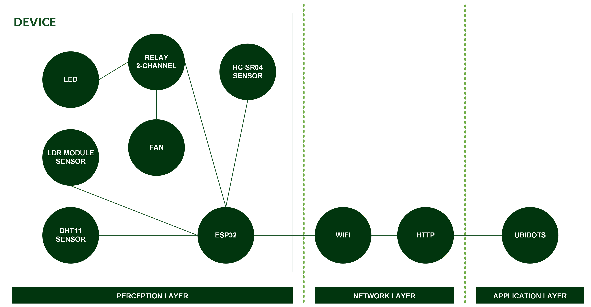

[](https://github.com/ellerbrock/open-source-badges/)
[](https://opensource.org/license/gpl-3.0)


# Ubidots Room Monitoring System
Smart room monitoring and control system — monitors temperature, humidity, light intensity, and occupancy, with real-time dashboard visualization and remote relay control through Ubidots.

<br><br>

## Project Requirements
| Part | Description |
| --- | --- |
| Development Board | DOIT ESP32 DEVKIT V1 |
| Code Editor | Arduino IDE 1.8.19 (Stable Legacy Version) |
| Driver | CP210X USB Driver |
| IoT Platform | Ubidots |
| Communications Protocol | Hypertext Transfer Protocol (HTTP) |
| IoT Architecture | 3 Layer |
| Programming Language | C/C++ |
| Arduino Library | • WiFi (default)<br>• HTTPClient (default)<br>• DHT sensor library by Adafruit (Version: 1.4.6) |
| Actuators | • Fan DC 5V (x1)<br>• Electromechanical relay 2-channel (x1)<br>• LED (x1) |
| Sensor | • DHT11: Air Temperature & Humidity (x1)<br>• LDR Sensor Module (x1)<br>• HC-SR04: Ultrasonic Sensor (x1) |
| Other Components | • Micro USB cable - USB type A (x1)<br>• ESP32 expansion board (x1)<br>• Breadboard (x1)<br>• Adaptor DC 9V 1A (x1)<br>• Resistor 220 ohm (x1)<br>• Jumper cable (1 set) |

<br><br>

## Download & Install
1. Arduino IDE

   <table><tr><td width="810">

   ```
   https://bit.ly/ArduinoIDE_Installer
   ```

   </td></tr></table><br>

2. CP210X USB Driver

   <table><tr><td width="810">
   
   ```
   https://bit.ly/CP210X_USBdriver
   ```

   </td></tr></table>
   
<br><br>

## Project Designs

<table>
<tr>
<th width="840">Architecture</th>
</tr>
<tr>
<td align="center"></td>
</tr>
</table>
<table>
<tr>
<th width="840">Software Design</th>
</tr>
<tr>
<td align="center"></td>
</tr>
</table>
<table>
<tr>
<th width="420">Pictorial Diagram</th>
<th width="420">Block Diagram</th>
</tr>
<tr>
<td align="center"></td>
<td align="center"></td>
</tr>
</table>
<table>
<tr>
<th width="840">Wiring</th>
</tr>
<tr>
<td align="center"></td>
</tr>
</table>

<br><br>

## Arduino IDE Setup
1. Open the ``` Arduino IDE ``` first, then open the project by clicking ``` File ``` -> ``` Open ``` :

   <table><tr><td width="810">
      
      ``` Code.ino ```

   </td></tr></table><br>
   
2. Fill in the ``` Additional Board Manager URLs ``` in Arduino IDE

   <table><tr><td width="810">
         
      Click ``` File ``` -> ``` Preferences ``` -> enter the ``` Boards Manager Url ``` by copying the following link :
      
      ```
      https://dl.espressif.com/dl/package_esp32_index.json
      ```

   </td></tr></table><br>
   
3. ``` Board Setup ``` in Arduino IDE

   <table>
      <tr><th width="810">

      How to setup the ``` DOIT ESP32 DEVKIT V1 ``` board
            
      </th></tr>
      <tr><td width="810">
         
      • Click ``` Tools ``` -> ``` Board ``` -> ``` Boards Manager ``` -> Install ``` esp32 ```.
   
      • Then selecting a board by clicking: ``` Tools ``` -> ``` Board ``` -> ``` ESP32 Arduino ``` -> ``` DOIT ESP32 DEVKIT V1 ```.

      </td></tr>
   </table><br>
   
4. ``` Change the Board Speed ``` in Arduino IDE

   <table><tr><td width="810">
         
      Click ``` Tools ``` -> ``` Upload Speed ``` -> ``` 115200 ```

   </td></tr></table><br>
   
5. ``` Install Library ``` in Arduino IDE

   <table><tr><td width="810">
         
      Download all the library zip files. Then paste it in the: ``` C:\Users\Computer_Username\Documents\Arduino\libraries ```

   </td></tr></table><br>

6. ``` Port Setup ``` in Arduino IDE

   <table><tr><td width="810">
         
      Click ``` Port ``` -> Choose according to your device port ``` (you can see in device manager) ```

   </td></tr></table><br>

7. Change the ``` WiFi Name ```, ``` WiFi Password ```, and so on according to what you are currently using.<br><br>

8. Before uploading the program, please click: ``` Verify ```.<br><br>

9. If there is no error in the program code, then please click: ``` Upload ```.<br><br>
    
10. Some things you need to do when using the ``` ESP32 board ``` :

    <table><tr><td width="810">
       
       • If ``` ESP32 board ``` cannot process ``` Source Code ``` totally -> Press ``` EN (RST) ``` button -> ``` Restart ```.

       • If ``` ESP32 board ``` cannot process ``` Source Code ``` automatically then :<br>

      - When information: ``` Uploading... ``` has appeared -> immediately press and hold the ``` BOOT ``` button.<br>

      - When information: ``` Writing at .... (%) ``` has appeared -> release the ``` BOOT ``` button.

      • If message: ``` Done Uploading ``` has appeared -> ``` The previously entered program can already be operated ```.

      • Do not press the ``` BOOT ``` and ``` EN ``` buttons at the same time as this may switch to ``` Upload Firmware ``` mode.

    </td></tr></table><br>

11. If there is still a problem when uploading the program, then try checking the ``` driver ``` / ``` port ``` / ``` others ``` section.

<br><br>

## Ubidots Setup
1. Getting started with Ubidots :

   <table><tr><td width="810">
   
      • Please <a href="https://industrial.ubidots.com/accounts/signin/">Log in</a> to access the ``` Ubidots ``` service.
      
      • If you don't have a ``` Ubidots ``` account yet, please create one.

   </td></tr></table><br>

2. Creating dashboards : 

   <table><tr><td width="810">
   
      • In the ``` Data ``` section -> select ``` Dashboards ``` menu.
   
      • Delete the Ubidots built-in demo dashboard before creating a new dashboard.
   
      • Click ``` Add new Dashboard ```.
   
      • ``` Name ```, ``` Tags ```, ``` Default time range ``` -> customize it to your needs.

      • ``` Dynamic Dashboard ``` -> change it to ``` Dynamic (Single Device) ```.

      • ``` Default Device ``` -> select the device you want to display.

      • Leave the other settings alone -> then click ``` SAVE ```.

   </td></tr></table><br>

3. Creating Text widget :

   <table><tr><td width="810">
   
      • Make sure you are in the ``` Dashboards ``` menu.
   
      • Click ``` + Add new widget ```.
   
      • Select ``` Text ``` to create a label.
   
      • Give the label a name, for example: ``` MONITORING ``` / ``` CONTROL ```.
   
      • Customize the style, size, and other details as needed.
   
      • Click ``` SAVE ``` to add the Text Widget to the dashboard.
   
      • If you want to change the content of the widget, please click the ``` pencil ``` symbol -> if so, then click ``` SAVE ```.

   </td></tr></table><br>

4. Creating Thermometer widget :

   <table><tr><td width="810">
   
      • Make sure you are in the ``` Dashboards ``` menu.
   
      • Click ``` + Add new widget ```.
   
      • Select ``` Thermometer ``` for room temperature.
   
      • Please set the variables that you want to use on the widget.
   
      • Customize the style, size, and other details as needed.
   
      • Click ``` SAVE ``` to add the Thermometer Widget to the dashboard.
   
      • If you want to change the content of the widget, please click the ``` pencil ``` symbol -> if so, then click ``` SAVE ```.

   </td></tr></table><br>

5. Creating Gauge widget :

   <table><tr><td width="810">
   
      • Make sure you are in the ``` Dashboards ``` menu.
   
      • Click ``` + Add new widget ```.
   
      • Select ``` Gauge ``` for room humidity.
   
      • Please set the variables that you want to use on the widget.
   
      • Customize the style, size, and other details as needed.
   
      • Click ``` SAVE ``` to add the Gauge Widget to the dashboard.
   
      • If you want to change the content of the widget, please click the ``` pencil ``` symbol -> if so, then click ``` SAVE ```.

   </td></tr></table><br>

6. Creating Indicator widget :

   <table><tr><td width="810">
   
      • Make sure you are in the ``` Dashboards ``` menu.
   
      • Click ``` + Add new widget ```.
   
      • Select ``` Indicator ``` to display the LED status based on the light intensity.
   
      • Please set the variables that you want to use on the widget.
   
      • Customize the style, size, and other details as needed.
   
      • Click ``` SAVE ``` to add the Indicator Widget to the dashboard.
   
      • If you want to change the content of the widget, please click the ``` pencil ``` symbol -> if so, then click ``` SAVE ```.

   </td></tr></table><br>

7. Creating Line Chart widget :

   <table><tr><td width="810">
   
      • Make sure you are in the ``` Dashboards ``` menu.
   
      • Click ``` + Add new widget ```.
   
      • Select ``` Line Chart ``` to visualize distance data.
   
      • Please set the variables that you want to use on the widget.
   
      • Customize the style, size, and other details as needed.
   
      • Click ``` SAVE ``` to add the Line Chart Widget to the dashboard.
   
      • If you want to change the content of the widget, please click the ``` pencil ``` symbol -> if so, then click ``` SAVE ```.

   </td></tr></table><br>

8. Creating HTML Canvas widget :

   <table><tr><td width="810">

      • Make sure you are in the ``` Dashboards ``` menu.
   
      • Click ``` + Add new widget ```.
   
      • Select ``` HTML Canvas ``` to create a custom visualization that displays the light intensity.
   
      • In the ``` Code Editor ``` section, please set it up as follows :<br><br>

      <table>
      <tr>
         <th align="left">HTML Code</th>
      <tr>
      <tr><td width="810">
               
      ```html
      
      <div class="ldr-widget">
          <div class="ldr-circle">
              <span id="ldr-value">-</span>
          </div>
      </div>
         
      ```
      </td></tr>
      </table><br>

      <table>
      <tr>
         <th align="left">CSS Code</th>
      <tr>
      <tr><td width="810">
               
      ```css
      
      html,
      body {
          width: 100%;
          height: 100%;
          margin: 0;
          padding: 0;
          overflow: hidden;
      }
      
      .ldr-widget {
          width: 100%;
          height: 100%;
          min-height: 200px;
          background: #ffffff;
          position: relative;
          font-family: Arial, sans-serif;
      }
      
      .ldr-title {
          position: absolute;
          top: 12px;
          left: 15px;
          font-size: 16px;
          font-weight: normal;
          color: #5e5e5e;
      }
      
      .ldr-circle {
          position: absolute;
          width: 160px;
          height: 160px;
          top: 50%;
          left: 50%;
          transform: translate(-50%, -50%);
          border-radius: 50%;
          background-color: #ff9800;
          display: flex;
          align-items: center;
          justify-content: center;
          color: #ffffff;
      }
      
      #ldr-value {
          font-size: 28px;
          font-weight: bold;
          line-height: 1;
      }
         
      ```
      </td></tr>
      </table><br>

      <table>
      <tr>
         <th align="left">JavaScript Code</th>
      <tr>
      <tr><td width="810">
               
      ```javascript
      
      const TOKEN = "UBIDOTS_TOKEN";
      const VARIABLE_ID = "VARIABLE_ID";
   
      function getLDRValue() {
      
          const url =
              "https://industrial.api.ubidots.com/api/v1.6/variables/" +
              VARIABLE_ID +
              "/values?page_size=1";
      
          fetch(url, {
              method: "GET",
              headers: {
                  "X-Auth-Token": TOKEN,
                  "Content-Type": "application/json"
              }
          })
              .then(response => response.json())
              .then(data => {
      
                  if (data.results && data.results.length > 0) {
      
                      const value = Number(data.results[0].value);
      
                      document.getElementById("ldr-value").textContent =
                          value.toFixed(1);
                  }
      
              })
              .catch(error => {
                  console.error("Error mengambil data LDR:", error);
              });
      }
      
      getLDRValue();
      setInterval(getLDRValue, 5000);
         
      ```
      </td></tr>
      </table><br>
   
      • Customize the style, size, and other details as needed.
   
      • Click ``` SAVE ``` to add the HTML Canvas Widget to the dashboard.
   
      • If you want to change the content of the widget, please click the ``` pencil ``` symbol -> if so, then click ``` SAVE ```.<br><br>

   </td></tr></table><br>

9. Creating Switch widget :

   <table><tr><td width="810">
   
      • Make sure you are in the ``` Dashboards ``` menu.
   
      • Click ``` + Add new widget ```.
   
      • Select ``` Switch ``` to control the Fan ON/OFF.
   
      • Please set the variables that you want to use on the widget.
   
      • Customize the style, size, and other details as needed.
   
      • Click ``` SAVE ``` to add the Switch Widget to the dashboard.
   
      • If you want to change the content of the widget, please click the ``` pencil ``` symbol -> if so, then click ``` SAVE ```.

   </td></tr></table><br>

10. Firmware configuration : 

    <table><tr><td width="810">
   
      • Click the ``` User ``` section in the bottom left corner -> then select ``` API Credentials ```.
   
      • Copy the ``` Default token ``` -> paste it into the firmware code. An example is as follows:

      <table><tr><td width="780">
   
      ```ino
      const char* token = "BBUS-aRZvtYRMM7IWbrKFcICR30YYP7dh5Q"; // define ubidots token
      ```

      </td></tr></table>

    </td></tr></table>

<br><br>

## Get Started
1. Download and extract this repository.<br><br>
    
2. Make sure you have the necessary electronic components.<br><br>
   
3. Make sure your components are designed according to the diagram.<br><br>
      
4. Configure your device according to the settings above.<br><br> 
 
5. Please enjoy [Done].

<br><br>

## Highlights

<table>
<tr>
<th width="840" colspan="4">Device</th>
</tr>
<tr>
<th width="420" colspan="2">DHT11 Sensor</th>
<th width="420" colspan="2">LDR Sensor</th>
</tr>
<tr>
<td width="210" align="center"></td>
<td width="210" align="center"></td>
<td width="210" align="center"></td>
<td width="210" align="center"></td>
</tr>
<tr>
<th width="840" colspan="4">HC-SR04 Sensor</th>
</tr>
<tr>
<td width="420" colspan="2" align="center"></td>
<td width="420" colspan="2" align="center"></td>
</tr>
<tr>
<th width="840" colspan="4">Switch (FAN)</th>
</tr>
<tr>
<td width="420" colspan="2" align="center"></td>
<td width="420" colspan="2" align="center"></td>
</tr>
<tr>
<th width="420" colspan="2">Switch (FAN): ON</th>
<th width="420" colspan="2">Switch (FAN): OFF</th>
</tr>
<tr>
<td colspan="2" align="center"></td>
<td colspan="2" align="center"></td>
</tr>
</table>
<table>
<tr>
<th width="840">Ubidots Dashboard</th>
</tr>
<tr>
<td align="center"></td>
</tr>
</table>

<br>
<strong>More information:</strong> <a href="https://github.com/cakraawijaya/Ubidots-Room-Monitoring-System/blob/master/Assets/Documentation/Report/Portofolio%20Pelatihan%20Sertifikasi%20BNSP%20IIoT%20-%20Devan%20Cakra%20Mudra%20Wijaya-14-35.pdf"><u>Click Here</u></a>

<br><br><br>

## Appreciation
If this work is useful to you, then support this work as a form of appreciation to the author by clicking the ``` ⭐Star ``` button at the top of the repository.

<br><br>

## Disclaimer
This application is the result of the development of the Edutic.id x BNSP Bootcamp 2026. I do not deny that I still use third-party services in this work, including: libraries, frameworks, and so on.
